<h2>EfficientNet-Malaria (Updated: 2022/08/31)</h2>
<a href="#1">1 EfficientNetV2 Malaria Cell Images Classification </a> 
<a href="#1.1">1.1 Clone repository</a> 
<a href="#1.2">1.2 Prepare Malaria Cell Images dataset</a> 
<a href="#1.3">1.3 Install Python packages</a> 
<a href="#2">2 Python classes for Malaria Cell Images Classification</a> 
<a href="#3">3 Pretrained model</a> 
<a href="#4">4 Train</a> 
<a href="#4.1">4.1 Train script</a> 
<a href="#4.2">4.2 Training result</a> 
<a href="#5">5 Inference</a> 
<a href="#5.1">5.1 Inference script</a> 
<a href="#5.2">5.2 Sample test images</a> 
<a href="#5.3">5.3 Inference result</a> 
<a href="#6">6 Evaluation</a> 
<a href="#6.1">6.1 Evaluation script</a> 
<a href="#6.2">6.2 Evaluation result</a> 

<h2>
<a id="1">1 EfficientNetV2 Malaria Cell Images Classification</a>
</h2>

 This is an experimental Malaria Cell Images Classification project based on <b>efficientnetv2</b> in <a href="https://github.com/google/automl">Brain AutoML</a>.
 
 The original Malaria Cell Images dataset has been taken from the following web site: 
<a href= "https://lhncbc.nlm.nih.gov/">
<b>National Library of Medicine</b> Lister Hill National Center for Biomedical Communications
</a>
 
 
<a href="https://data.lhncbc.nlm.nih.gov/public/Malaria/cell_images.zip">
Malaria/cell_images.zip
</a>
 
 We use python 3.8 and tensorflow 2.8.0 environment on Windows 11. 
<h3>
<a id="1.1">1.1 Clone repository</a>
</h3>
 Please run the following command in your working directory: 
<pre>
git clone https://github.com/atlan-antillia/EfficientNet-Malaria.git
</pre>
You will have the following directory tree: 
<pre>
.
├─asset
└─projects
    └─Malaria
        ├─eval
        ├─evaluation
        ├─inference        
        └─test
</pre>
<h3>
<a id="1.2">1.2 Malaria Cell Images dataset</a>
</h3>

Please download the dataset <b>Malaria_cell_images</b> from the following web site:
 
<a href="https://data.lhncbc.nlm.nih.gov/public/Malaria/cell_images.zip">cell_images.zip</a>
 
 

<pre>
.
├─asset
└─projects
    └─Malaria
        ├─Malaria_Cell_Images
        │  ├─test
        │  │  ├─Parasitized
        │  │  └─Uninfected
        │  └─train
        │      ├─Parasitized
        │      └─Uninfected
        └─test     
　...
</pre>
You can easily split the original cell_images dataset into train and test by running
<a href="./projects/Malaria/split_master.py">split_master.py</a>:
<pre>
>python split_master.py
</pre>
 
  
Sample images of Malaria_Cell_Images/train/Parasitized: 
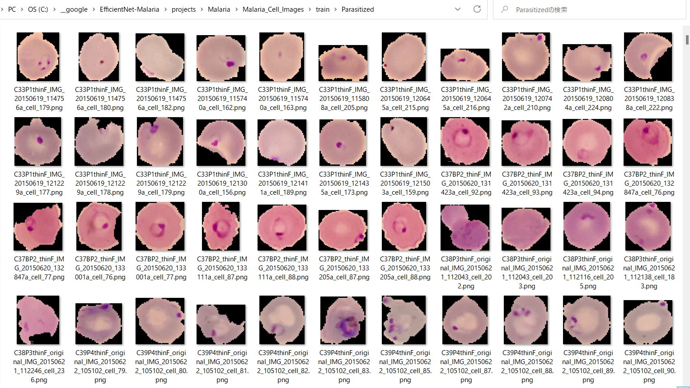
  
 
Sample images of Malaria_Cell_Images/train/Uninfected: 
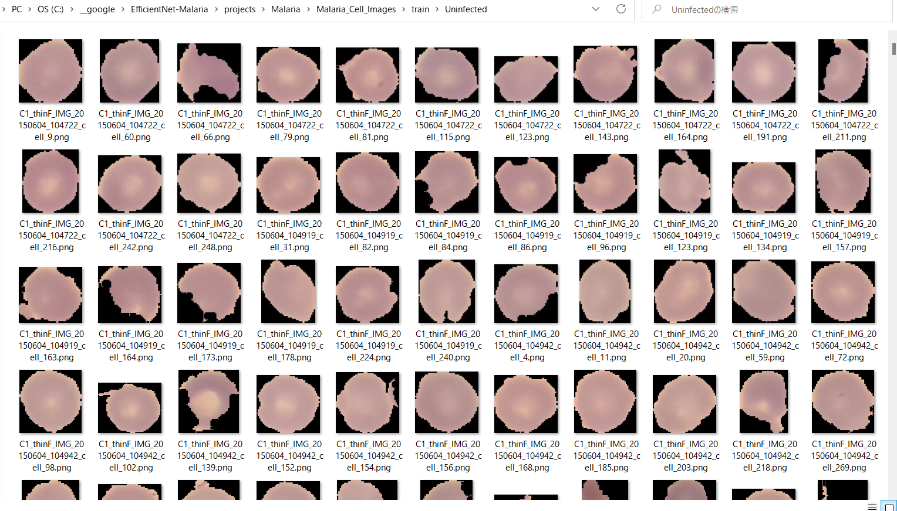

  
 

The number of images in train and test dataset: 
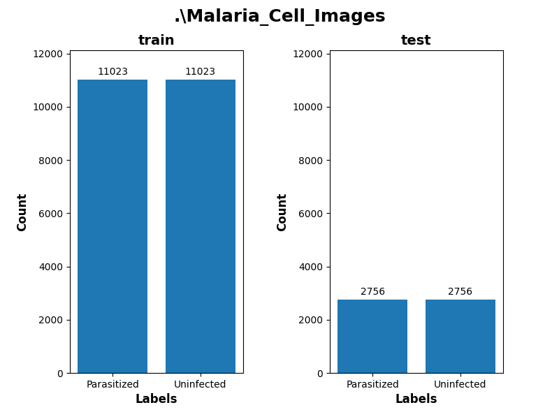
 
 

<h3>
<a id="#1.3">1.3 Install Python packages</a>
</h3>
Please run the following commnad to install Python packages for this project. 
<pre>
pip install -r requirements.txt
</pre>
 

<h2>
<a id="2">2 Python classes for Malaria Cell Images Classification</a>
</h2>
We have defined the following python classes to implement our Malaria Cell Images Classification. 
<li>
<a href="./ClassificationReportWriter.py">ClassificationReportWriter</a>
</li>
<li>
<a href="./ConfusionMatrix.py">ConfusionMatrix</a>
</li>
<li>
<a href="./CustomDataset.py">CustomDataset</a>
</li>
<li>
<a href="./EpochChangeCallback.py">EpochChangeCallback</a>
</li>
<li>
<a href="./EfficientNetV2Evaluator.py">EfficientNetV2Evaluator</a>
</li>
<li>
<a href="./EfficientNetV2Inferencer.py">EfficientNetV2Inferencer</a>
</li>
<li>
<a href="./EfficientNetV2ModelTrainer.py">EfficientNetV2ModelTrainer</a>
</li>
<li>
<a href="./FineTuningModel.py">FineTuningModel</a>
</li>

<li>
<a href="./TestDataset.py">TestDataset</a>
</li>

<h2>
<a id="3">3 Pretrained model</a>
</h2>
 We have used pretrained <b>efficientnetv2-b0</b> to train Malaria FineTuning Model.
Please download the pretrained checkpoint file 
from <a href="https://storage.googleapis.com/cloud-tpu-checkpoints/efficientnet/v2/efficientnetv2-b0.tgz">efficientnetv2-b0.tgz</a>, expand it, and place the model under our top repository.

<pre>
.
├─asset
├─efficientnetv2-b0
└─projects
        ├─Malaria
  ...
</pre>

<h2>
<a id="4">4 Train</a>

</h2>
<h3>
<a id="4.1">4.1 Train script</a>
</h3>
Please run the following bat file to train our Malaria efficientnetv2 model by using
<b>Malaria_Cell_Images/train</b>.
<pre>
./1_train.bat
</pre>
<pre>
rem 1_train.bat
python ../../EfficientNetV2ModelTrainer.py ^
  --model_dir=./models ^
  --eval_dir=./eval ^
  --model_name=efficientnetv2-b0 ^
  --data_generator_config=./data_generator.config ^
  --ckpt_dir=../../efficientnetv2-b0/model ^
  --optimizer=rmsprop ^
  --image_size=224 ^
  --eval_image_size=224 ^
  --data_dir=./Malaria_Cell_Images/train ^
  --data_augmentation=True ^
  --fine_tuning=True ^
  --monitor=val_loss ^
  --learning_rate=0.0001 ^
  --trainable_layers_ratio=0.4 ^
  --dropout_rate=0.5 ^
  --num_epochs=50 ^
  --batch_size=8 ^
  --patience=10 ^
  --debug=True  
</pre>
, where data_generator.config is the following: 
<pre>
; data_generation.config

[training]
validation_split   = 0.2
featurewise_center = False
samplewise_center  = False
featurewise_std_normalization=False
samplewise_std_normalization =False
zca_whitening                =False
rotation_range     = 10
horizontal_flip    = True
vertical_flip      = True
width_shift_range  = 0.1
height_shift_range = 0.1
shear_range        = 0.1
zoom_range         = [0.2, 2.0]
data_format        = "channels_last"

</pre>

<h3>
<a id="4.2">4.2 Training result</a>
</h3>

This will generate a <b>best_model.h5</b> in the models folder specified by --model_dir parameter. 
Furthermore, it will generate a <a href="./projects/Malaris/eval/train_accuracies.csv">train_accuracies</a>
and <a href="./projects/Malaria/eval/train_losses.csv">train_losses</a> files
 
Training console output: 
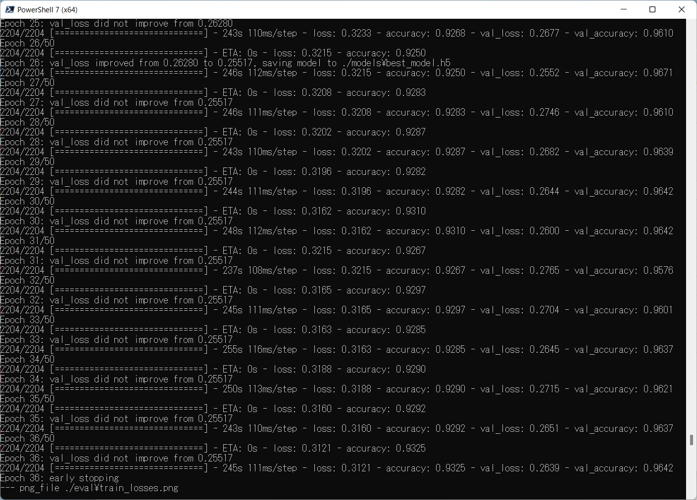 
 
Train_accuracies: 
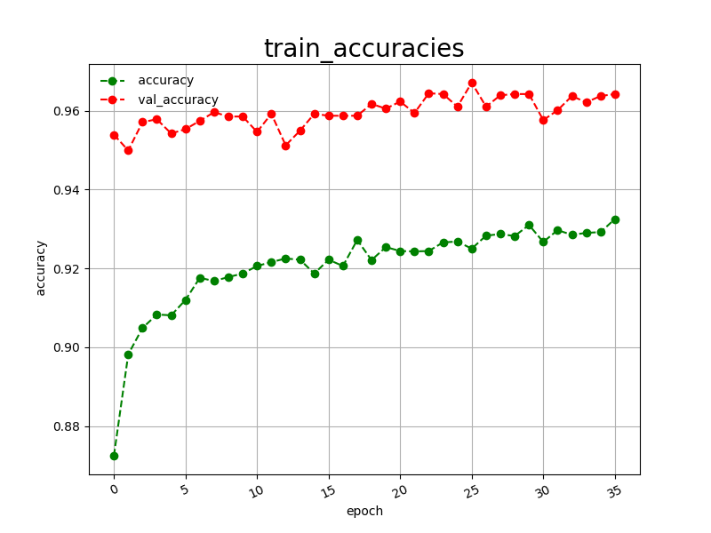 

 
Train_losses: 
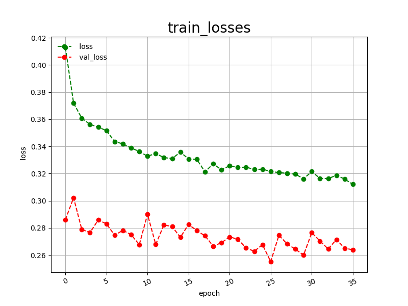 

 
<h2>
<a id="5">5 Inference</a>
</h2>
<h3>
<a id="5.1">5.1 Inference script</a>
</h3>
Please run the following bat file to infer the skin cancer lesions in test images by the model generated by the above train command. 
<pre>
./2_inference.bat
</pre>
<pre>
rem 2_inference.bat
python ../../EfficientNetV2Inferencer.py ^
  --model_name=efficientnetv2-b0  ^
  --model_dir=./models ^
  --fine_tuning=True ^
  --trainable_layers_ratio=0.4 ^
  --dropout_rate=0.5 ^
  --image_path=./test/*.png ^
  --eval_image_size=224 ^
  --label_map=./label_map.txt ^
  --mixed_precision=True ^
  --infer_dir=./inference ^
  --debug=False  
</pre>
 
label_map.txt:
<pre>
Parasitized
Uninfected
</pre>
 
<h3>
<a id="5.2">5.2 Sample test images</a>
</h3>

Sample test images generated by <a href="./projects/Malaria/create_test_dataset.py">create_test_dataset.py</a> 
from <a href="./projects/Malaris/Malaria_Cells_Image/test">alaria_Cells_Image/test</a>.
 
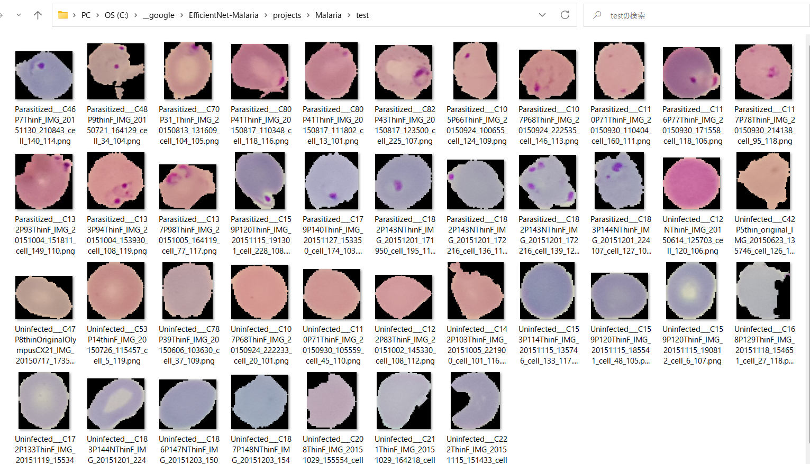 

 
<h3>
<a id="5.3">5.3 Inference result</a>
</h3>
This inference command will generate <a href="./projects/Malaria/inference/inference.csv">inference result file</a>.
 At this time, you can see the inference accuracy for the test dataset by our trained model is very low.
More experiments will be needed to improve accuracy. 

 
Inference console output: 
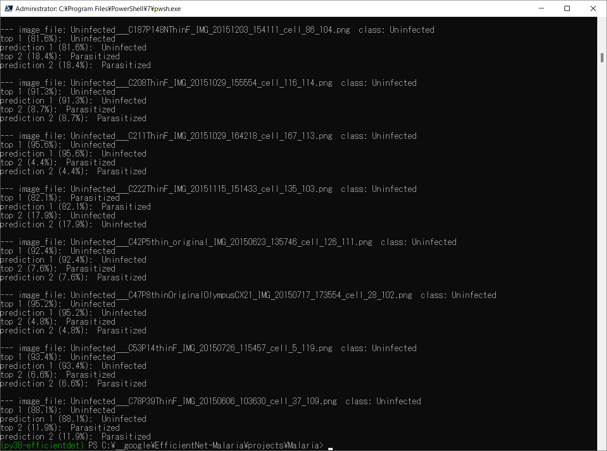 
 

Inference result (inference.csv): 
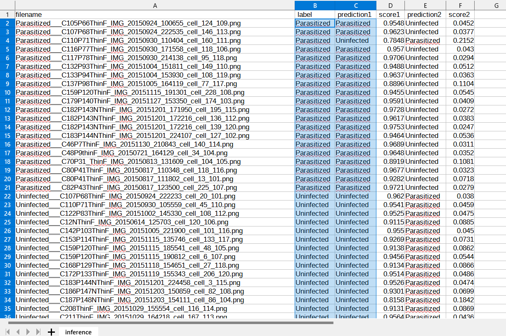 
 
<h2>
<a id="6">6 Evaluation</a>
</h2>
<h3>
<a id="6.1">6.1 Evaluation script</a>
</h3>
Please run the following bat file to evaluate <a href="./projects/Malaris/Malaria_Cell_Images/test">
Malaris_Cell_Images/test</a> by the trained model. 
<pre>
./3_evaluate.bat
</pre>
<pre>
rem 3_evaluate.bat
python ../../EfficientNetV2Evaluator.py ^
  --model_name=efficientnetv2-b0  ^
  --model_dir=./models ^
  --data_dir=./Malaria_Cell_Images/test ^
  --evaluation_dir=./evaluation ^
  --fine_tuning=True ^
  --trainable_layers_ratio=0.4 ^
  --dropout_rate=0.5 ^
  --eval_image_size=224 ^
  --mixed_precision=True ^
  --debug=False 

</pre>
 

<h3>
<a id="6.2">6.2 Evaluation result</a>
</h3>

This evaluation command will generate <a href="./projects/Malaris/evaluation/classification_report.csv">a classification report</a>
 and <a href="./projects/Malaris/evaluation/confusion_matrix.png">a confusion_matrix</a>.
 
 
Evaluation console output: 
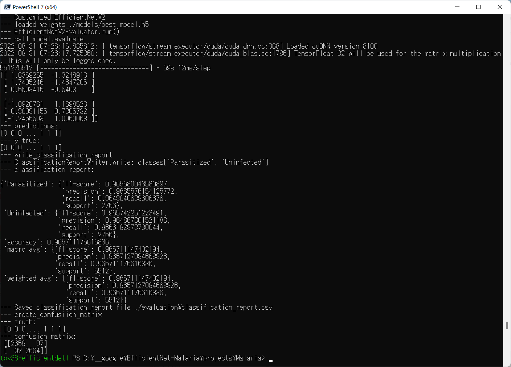 
 

 
Classification report: 
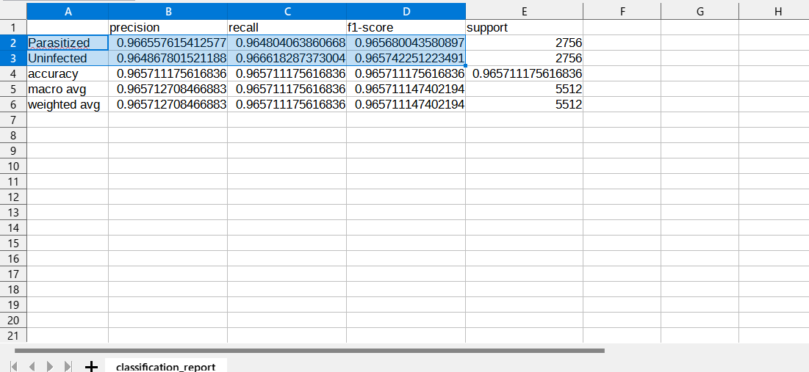 
 
Confusion matrix: 
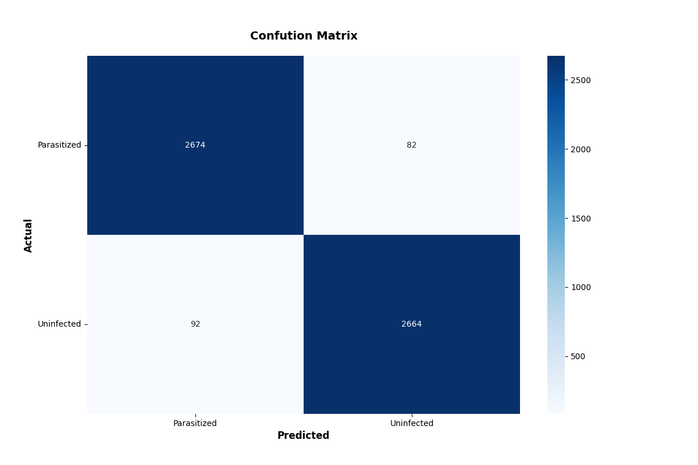 

